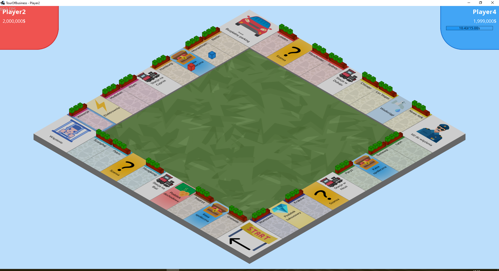
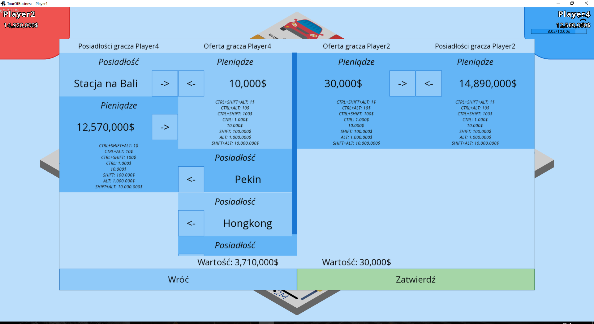

# TourOfBusinessGDX
A simple game inspired by a board game known to pretty much everyone.

## Usage
Build the project with gradle. Artifact in the desktop subproject should be runnable.

***Do not*** run this code with any kind of privileges, it might (and probably does) contain security vulnerabilities.

Command line options:

```
--fps                  Adds fps overlay to the client
--ip <ip>              IP of the server (only used in client)
--network-activity     Adds network activity overlay to the client
--port <port>          Port of the server
--server               Headless server mode
--windowed             Start game in window
```

## Screenshots




## Attributions

<a href="https://www.flaticon.com/free-icons/chest" title="chest icons">Chest icons created by Smashicons - Flaticon</a>

<a href="https://www.flaticon.com/free-icons/thunder" title="thunder icons">Thunder icons created by Vectors Market -
Flaticon</a>

<a href="https://www.flaticon.com/free-icons/policeman" title="policeman icons">Policeman icons created by Roundicons -
Flaticon</a>

<a href="https://www.flaticon.com/free-icons/money" title="money icons">Money icons created by Dimitry Miroliubov -
Flaticon</a>

<a href="https://www.flaticon.com/free-icons/jail" title="jail icons">Jail icons created by Flat Icons - Flaticon</a>

<a href="https://www.flaticon.com/free-icons/diamond" title="diamond icons">Diamond icons created by Freepik - Flaticon</a>

<a href="https://www.flaticon.com/free-icons/car" title="car icons">Car icons created by Vectors Market - Flaticon</a>

<a href="https://www.flaticon.com/free-icons/start" title="start icons">Start icons created by Freepik - Flaticon</a>

<a href="https://www.flaticon.com/free-icons/train" title="train icons">Train icons created by Freepik - Flaticon</a>

<a href="https://www.flaticon.com/free-icons/water-tap" title="water tap icons">Water tap icons created by Freepik - Flaticon</a>
